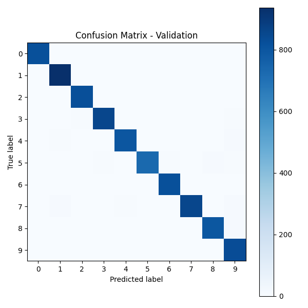

# Digit Recognizer Model Card

### Basic Information

* **Person or organization developing model**: Yousef Alkahtany, yalkahtany27@gwmail.gwu.edu
* **Model date**: December, 2025
* **Model version**: 1.0
* **License**: MIT
* **Model implementation code**: [Digit_Recognizer.ipynb](Digit_Recognizer.ipynb)

### Intended Use

* **Primary intended uses**:  
  This model is an *example* handwritten digit classifier that predicts digits (0–9) from 28×28 grayscale images. It is used as a classroom example for image classification, deep learning, and the Kaggle **Digit Recognizer** competition (MNIST in CSV format).

* **Primary intended users**:  
  Students in GWU DNSC 63xx / data science and machine learning courses.

* **Out-of-scope use cases**:  
  Any use beyond an educational example is out-of-scope. In particular, this model should not be used in real applications such as bank check reading, grading exams, ID or security decisions, or any financial or legal decision-making.

---

### Training Data

* **Data dictionary:**

| Name                  | Modeling Role | Measurement Level | Description |
|-----------------------|---------------|-------------------|-------------|
| `pixel0` – `pixel783` | inputs        | int (0–255)       | Grayscale pixel intensity for each of the 784 pixels in a 28×28 handwritten digit image (row-major order). |
| `label`               | target        | int (0–9)         | The true digit shown in the image. |

* **Source of training data**:  
  Kaggle **Digit Recognizer** competition (`train.csv`), which is a CSV version of the MNIST handwritten digit dataset.

* **How training data was divided into training and validation data**:  
  The 42,000 labeled rows in `train.csv` were randomly split using `train_test_split` with `stratify=label` and `random_state=42` into:
  * 80% training
  * 20% validation

* **Number of rows in training and validation data**:
  * Training rows: **33,600**
  * Validation rows: **8,400**

---

### Test Data

* **Source of test data**:  
  Kaggle **Digit Recognizer** competition (`test.csv` and `sample_submission.csv`).

* **Number of rows in test data**:
  * Test rows: **28,000**

* **State any differences in columns between training and test data**:  
  The test data includes the same pixel columns (`pixel0`–`pixel783`) as the training data but does **not** contain the `label` column.  
  True labels for the test data are only available indirectly through the Kaggle public leaderboard after a `submission.csv` file is uploaded.

---

### Model details

* **Columns used as inputs in the final model**:  
  All pixel columns `pixel0`–`pixel783`, scaled to `[0, 1]` and reshaped into images of shape `(28, 28, 1)`.

* **Column(s) used as target(s) in the final model**:  
  `label` – digit class from 0 to 9.

* **Type of model**:  
  Convolutional Neural Network (CNN) for multi-class image classification.

* **Software used to implement the model**:  
  Python (Google Colab), TensorFlow / Keras, NumPy, pandas, scikit-learn, matplotlib.

* **Version of the modeling software**:  
  Colab default at time of training (Python 3.x, TensorFlow 2.x).

* **Hyperparameters or other settings of your model**:

```python
# CNN architecture (Keras Sequential)

Conv2D(32, (3, 3), activation="relu", input_shape=(28, 28, 1))
MaxPooling2D((2, 2))
Conv2D(64, (3, 3), activation="relu")
MaxPooling2D((2, 2))
Flatten()
Dense(128, activation="relu")
Dense(10, activation="softmax")

optimizer = "adam"
loss = "sparse_categorical_crossentropy"
metrics = ["accuracy"]

batch_size = 128
epochs_with_train_val_split = 10       # initial training with validation
extra_epochs_full_training_data = 3    # retrain on all 42,000 rows
random_state_for_split = 42
```

---

### Quantitative Analysis

*Models were assessed with overall accuracy and a confusion matrix; Kaggle provides a public test accuracy.*

| Train Accuracy (full data) | Validation Accuracy | Kaggle Public Accuracy |
|----------------------------|---------------------|------------------------|
| ~0.997                     | ~0.988              | **0.98935**            |

Table 1. Accuracy values across data partitions and Kaggle public leaderboard.

#### Confusion Matrix



Figure 1. Confusion matrix for the validation data. Most of the mass lies on the diagonal, which means the CNN correctly predicts most digits. The few off-diagonal cells correspond to rare confusions between visually similar digits (for example, some 3/5/8 mistakes).

---

### Ethical Considerations

* **Potential negative impacts of using my model**

  *Math / software issues*  
  * The model may overfit MNIST-style digits; performance on very different handwriting styles, resolutions, or noise levels is unknown.  
  * Bugs in preprocessing (such as incorrect scaling or reshaping) could silently reduce accuracy.

  *Real-world risks*  
  * If a similar model were deployed in real systems (check processing, exam scoring, ID reading), misclassifications could cause financial errors or unfair outcomes.  
  * Some handwriting styles might be under-represented in MNIST, which could lead to higher error rates for some groups of users.

* **Potential uncertainties relating to the impacts of using your model**

  * The model has only been evaluated on the Kaggle/MNIST digits, not on other datasets, noisy images, or adversarial examples.  
  * The dataset does not include demographic attributes, so fairness across groups cannot be measured.  
  * Long-term effects of embedding similar models in larger decision workflows are unknown.

* **Unexpected results**

  * A relatively small CNN trained for only a modest number of epochs achieved high performance (~98.8% validation accuracy and 0.98935 Kaggle public accuracy).  
  * Most remaining errors are between digits that are visually similar to humans, suggesting that additional data augmentation or slightly deeper architectures could reduce these mistakes further.
 
* Tools and sources used:
This model card and parts of the training code were written by me with assistance from OpenAI’s ChatGPT (GPT-5.1 Thinking), based on the GWU DNSC 6301 example project and the Kaggle Digit Recognizer competition data. I reviewed, edited, and tested all code and text before submitting.
